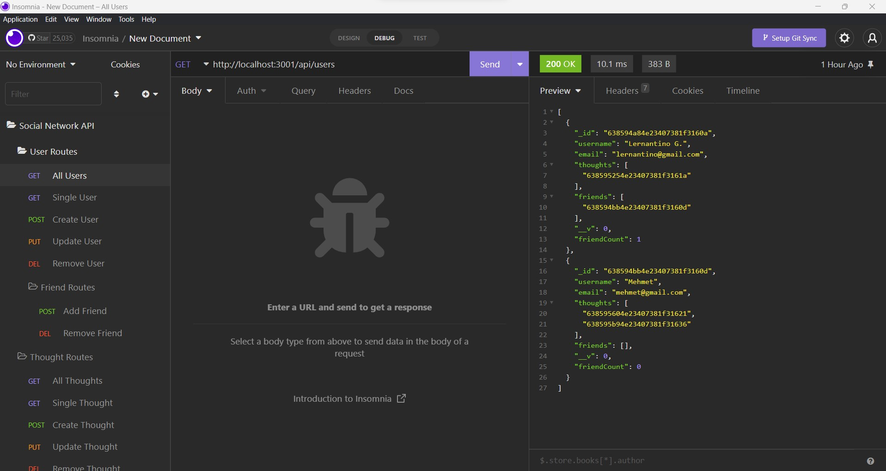
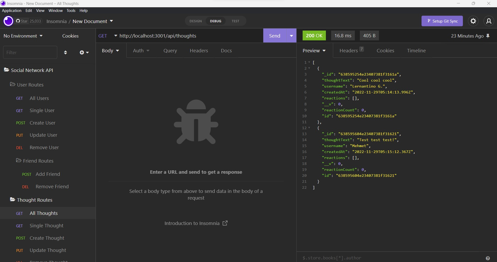

# Social Network API


## Table of Contents

* [Description](#description)
* [Usage Demonstration Link](#usage-demonstration-link)
* [User Story](#user-story)
* [Screenshots](#screenshots)
* [Code Snippets](#code-snippets)
* [Technologies Used](#technologies-used)
* [Credits](#credits)
* [Author Links](#author-links)
* [License](#license)


## Description

 This project provides the backend and database for a social network application that allows its users to generate thoughts and react to thoughts of other users in their network. On the backend side, the project uses Express.js for providing all the necessary API routes. User related API routes provides the functionality for fetching a single user or all users, creating a new user, updating an existing user, removing a user, adding friends to a user's network, and removing friends from a user's network. Thought related API routes provides the functionality for fetching a single thought or all thoughts, creating a new thought, updating an existing thought, removing a thought, creating reactions about a thought, and removing reactions from a thought. On the database side, the project leverages MongoDB which is a NoSQL database simplifying the storage of unstructured data used in this social network application.


## Usage Demonstration Link

Usage demonstration link is [here](https://drive.google.com/file/d/1auLz-KZrFWh9bRF3KE9t1bTNu1w_GBWc/view)


## User Story

| As a                   | I want                                                  | So that   
| ---------------------- | ------------------------------------------------------- | ---------------------------------------------------------- |
| `social media startup` | an API for my social network that uses a NoSQL database | `my website can handle large amounts of unstructured data` |


## Screenshots

### *Getting all users*



### *Getting all thoughts*




## Code Snippets

### Remove user:
####  Removing a user and that user's thoughts by user id.
```

    removeUser(req, res) {
        User.findOneAndDelete({ _id: req.params.userId })
            .then((user) =>
                !user
                    ? res.status(404).json({ message: "User not found with that ID!" })
                    : Thought.deleteMany({ _id: { $in: user.thoughts } })
            )
            .then(() => res.json({ message: "Successfully removed user and user's thoughts" }))
            .catch((err) => res.status(500).json(err));
    }

```

### Add friend:
####  Adding a friend to a user.
```

    addFriend(req, res) {
        console.log('You are adding a friend');
        User.findOneAndUpdate(
            { _id: req.params.userId },
            { $addToSet: { friends: req.params.friendId } },
            { runValidators: true, new: true }
        )
            .then((user) =>
                !user
                    ? res.status(404).json({ message: "User not found with that ID!" })
                    : res.json(user)
            )
            .catch((err) => res.status(500).json(err));
    }

```

### Remove reaction:
####  Removing a reaction from a thought.
```

    removeReaction(req, res) {
        Thought.findOneAndUpdate(
            { _id: req.params.thoughtId },
            { $pull: { reactions: { reactionId: req.params.reactionId } } },
            { runValidators: true, new: true }
        )
            .then((thought) => {
                !thought
                    ? res.status(404).json({ message: "Thought not found with that ID!" })
                    : res.json(thought);
            })
            .catch((err) => res.status(500).json(err));
    },

```


## Technologies Used

- JavaScript
- Node.js
- MongoDB
- Insomnia
- Npm mongoose 
- Npm express 
- Gitbash
- GitHub    
- Screencastify


## Credits

[Npm Mongoose](https://www.npmjs.com/package/mongoose)

[Npm Express](https://www.npmjs.com/package/express)


## Author Links

[LinkedIn Profile](https://www.linkedin.com/in/mehmet-musabeyoglu)

[GitHub Profile](https://github.com/MehmetMusabeyoglu)

[E-mail Address](mailto:mehmetmusabeyoglu@gmail.com) 

[Medium Profile](https://medium.com/@mehmetmusabeyoglu) 


## License 

 This project is licensed under the MIT License 
 <br>
 [](https://opensource.org/licenses/MIT)

